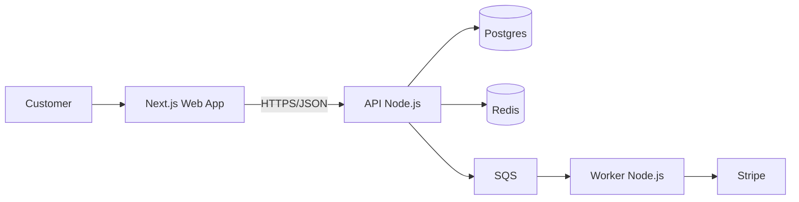

## Rule

Architecture documentation answers "how is the system shaped?" — not "what does every class do?". It lives in the repo, stays close to the code, and updates when the architecture changes. The audience is a developer joining the team who needs to be productive within a week.

## Pattern — C4 model

C4 (Simon Brown) gives four levels of zoom. Most projects need only the first two diagrams.

### Level 1 — System Context

Shows the system + its users + external systems. No internal detail.

```
[Customer] ─→ [E-commerce Platform] ─→ [Stripe]
                                  │
                                  └─→ [SendGrid]
                                  │
                                  └─→ [Analytics]
```

One diagram. Half a page. Tells you what the system is, who uses it, and what it depends on.

### Level 2 — Containers

Shows the runnable processes (web app, API, worker, DB). Each is a deployable unit.

```
[Customer] ─→ [Next.js Web App]
                  │
                  ↓ HTTPS/JSON
              [API (Node.js)]
                  │
                  ├─→ [Postgres]
                  ├─→ [Redis]
                  └─→ [SQS] ─→ [Worker (Node.js)] ─→ [Stripe]
```

For each container, note: language/framework, deployment target, key responsibilities.

### Level 3 — Components (optional)

Inside one container, the major modules. Only zoom here for containers that are large or surprising. Skip for simple ones.

### Level 4 — Code (almost never)

Class diagrams. Almost never useful — the IDE shows this already.

## Document structure

```markdown
# Architecture

## Overview
<2 paragraphs. The shape of the system in plain English.>

## System Context (Level 1)
<Diagram + 1 paragraph per external system>

## Containers (Level 2)
<Diagram + 1 section per container with deployment + responsibilities>

## Cross-cutting concerns
- Authentication / authorization model
- Data model (link to ERD or list key tables)
- Multi-tenancy approach
- Observability (logging / metrics / tracing)
- Deployment topology
- Disaster recovery / backup

## Key decisions
- Link to ADRs that shaped this architecture

## Out of scope
- Things deliberately not done (e.g. "no caching layer for now — see ADR 0012")
```

## Diagram tools — pick one

| Tool | Pros | Cons |
|---|---|---|
| **Mermaid** (committed to repo) | Renders in GitHub; lives with code | Limited for complex layouts |
| **PlantUML** | Powerful; many diagram types | Requires server or local install |
| **D2** | Modern; nice output | Less ecosystem |
| **draw.io / Excalidraw** | Visual editing | Source is JSON/SVG; less diff-friendly |
| **Hand-drawn / TLDraw** | Fast; collaborative | Hard to keep in sync with code |

For most teams: **Mermaid in the README/docs**. Diagrams diff readably, render in PRs, no external tool.



## What to put in vs leave out

| In | Out |
|---|---|
| Container boundaries and the protocol between them | Function signatures |
| Why a particular DB / queue was chosen | The schema (link to schema doc) |
| Authentication model at a high level | The exact JWT claim names (link to auth code) |
| Failure modes and what mitigates them | Class hierarchies |
| Deployment topology | CI step counts |
| Cross-cutting concerns (multi-tenancy, observability) | Specific monitoring tool config |

The rule: anything an editor would update on every commit doesn't belong; anything that survives months at a time does.

## Keeping it current

A stale architecture doc is worse than no doc — readers trust it and get misled.

| Mechanism | How |
|---|---|
| **Quarterly review** in calendar | Light read-through; update what's drifted |
| **PR template hook** | PRs that change deployment / data model link the relevant doc section to update |
| **Stage 2 gate audit** in this plugin | Verifies doc reflects code |
| **New-joiner test** | Onboard someone; track what surprised them; document those |

## Anti-patterns

- ❌ A 50-page architecture doc that nobody reads (one container per page, four levels deep, no diagrams)
- ❌ "Architecture" = code class diagrams generated from source (low value)
- ❌ "Architecture" = a single PowerPoint slide (no detail)
- ❌ Diagrams maintained externally (Lucidchart, Miro) — drift fast, no diff
- ❌ Out of sync with code — doc says we use Redis, code uses Memcached
- ❌ Single dev maintains it as a hobby project — should be team-owned
- ❌ No "out of scope" section — readers can't tell what was deliberately omitted

## Gate criteria

- `docs/architecture.md` (or equivalent) exists
- Level 1 + Level 2 diagrams are present and rendered (Mermaid or rendered image)
- Each container has language, deployment target, and responsibilities documented
- Cross-cutting concerns section covers auth, data, multi-tenancy, observability, deployment
- Links to ADRs are present
- A "last reviewed" date or quarterly review process is in place
- Out-of-scope section explicitly lists what is *not* done and why
